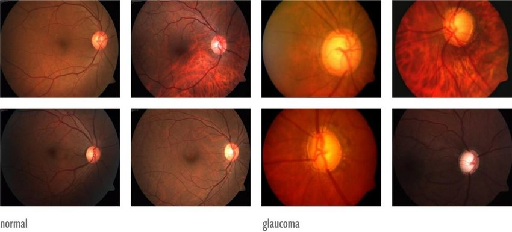

<h1 align = "center">Hello Earthlings!</h1>

My name is Mustapha (pronounced *moos-ta-fa* not *moo-fa-sa*), and I am currently working and researching on:

- Analytics for fast paced sports: (:soccer: :basketball: :ice_hockey:)
  - Events detection.
  - Frame annotation.
  - Analysis of tracking and events data. 
- Healthcare AI: 
  - Deep learning for medical diagnosis :hospital:
  - Glaucoma diagnosis using the Retina Fundus Images for Glaucoma Analysis (RIGA) dataset :eye:

I **enjoy** talking about coding and new project ideas, so don't hesitate to say hi!

